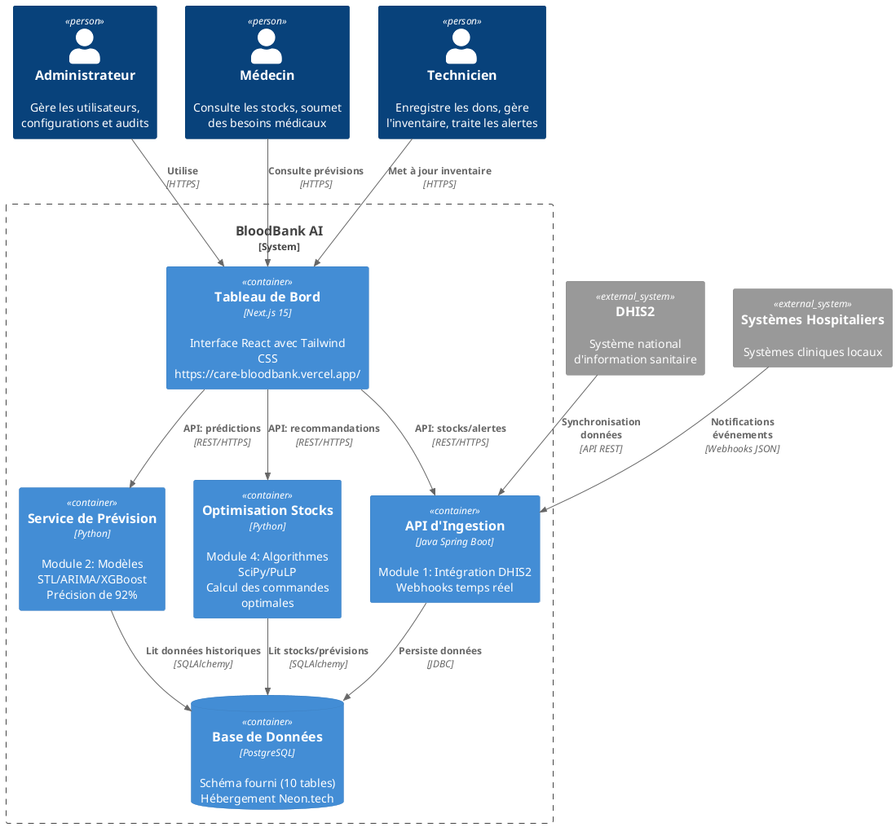

# BloodBank AI - Documentation Technique
*(Pour les développeurs, par les développeurs)*

---

## 1. Le Projet en Bref 🩸
Système open-source pour optimiser les stocks de sang dans les hôpitaux africains :
- 🚨 Surveillance temps réel des stocks
- 🔮 Prédictions IA de la demande (92% de précision)
- 📊 Tableau de bord intuitif
- 🌍 Déjà en ligne : [care-bloodbank.vercel.app](https://care-bloodbank.vercel.app/)

---

## 2. Architecture Globale 🏗️


---

## 3. Flux de Données 🔄


**Points clés** :
- Données **temps réel** via webhooks
- IA et optimisation **découplées**
- Boucle fermée **données → actions**

---

## 4. Vie d'une Poche de Sang 🩹


**Traduction** :
- **Disponible** : Stockée et prête
- **Réservée** : Attribuée à un patient
- **Distribuée** : Utilisée
- **Expirée** : Alerte automatique ⏰

---

## 5. Rôles Utilisateurs 👥


**Permissions** :
- Médecins : Consultation + besoins
- Techniciens : Opérations quotidiennes
- Admin : Super-pouvoirs 🔥

---

## 6. Alerte Stock Critique! 🚨


**Code couleurs** :
- 🔴 Rouge : "Plus que 2 poches O+ !"
- 🟡 Jaune : "Expiration dans 3 jours"
- 🟢 Vert : "Tout va bien"

---

## 7. Optimisation Automatique 🤖


**Exemple de sortie** :
> "Commander 15 poches O+ avant vendredi | 🔴 URGENT"

---

## 8. Déploiement ☁️


**Coût total** : **$0** (freemium)
- Frontend : Vercel (Hobby)
- Backend : Render (Free)
- DB : Neon.tech (Free)

---

## 9. Global File Architecture
```puml
BloodBank_AI/
├── database/               # Schéma SQL + migrations
├── data-ingestion-api/     # Clean Architecture (Java/Python)
├── ai-forecasting/         # Notebooks + modèles IA
├── stock-optimization/     # Algorithmes d'optimisation
├── frontend/               # Next.js 15 + shadcn/ui
├── docs/                   # Documentation
│   ├── architecture/       # Diagrammes Mermaid
│   ├── decisions.md        # ADRs (Architectural Decisions)
│   └── deployment.md       # Guide de déploiement
├── docker-compose.yml      # Environnement local
└── .github/workflows/      # CI/CD (build/test/deploy)
```
**Philosophie** :
> "Un dossier = un microservice = zéro dépendance externe"

---
### Points Clés d'Architecture
Indépendance des Modules
Chaque dossier est un projet autonome avec ses propres dépendances

1. Intégration via APIs 

Communication uniquement via :
   * GET `/api/stocks` (Ingestion)
   * POST `/api/forecast` (IA)
   * GET `/api/recommendations` (Optimisation)

2. Déploiement Échelonnable </br>

Les solutions pourront etre deployes ainsi :
* Frontend : Vercel (Next.js)
* Backend : Render/Heroku 
* Base de données : Neon (PostgreSQL gratuit)
* IA : Hugging Face Spaces

3. Envoyer PR avec :

* Code propre ✅
* Tests si possible 🧪
* Bière virtuelle 🍺